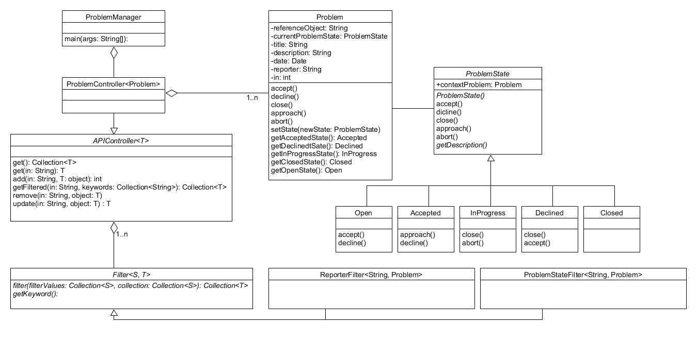

# ProblemManagement Class Diagram

This digram is split into three parts: problem, controller and filter. The problem part ist the main datastructure describing a problem and its problemstate as statemachine. It is closer described in [Problem](https://git.scc.kit.edu/cm-tm/cm-team/3.projectwork/pse/domain/1-problem/-/blob/dev/pages/bounded_context_entity_relation_view.md). The Controller and Filter are units to control changes and filter for requests.

A description of the identification number called "in" in this diagram can be found in the [Ubiquitous Language](https://git.scc.kit.edu/-/ide/project/cm-tm/cm-team/3.projectwork/pse/docsc/tree/english-translation/-/pages/ubiquitous_language.md/).
