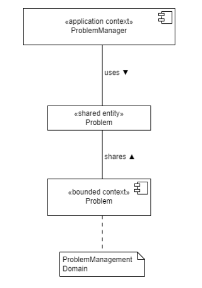

# ProblemManager Sharing View

The ProblemManager application handles requests. It uses entities of the Problem Context, provided by the ProblemManagement domain.

Die Anwendung des ProblemManager kümmert sich um die Abwicklung der Problem Anfragen. Sie verwendet die Entitäten des Problem Context, der von der ProblemManagement Domain bereitgestellt wird.

