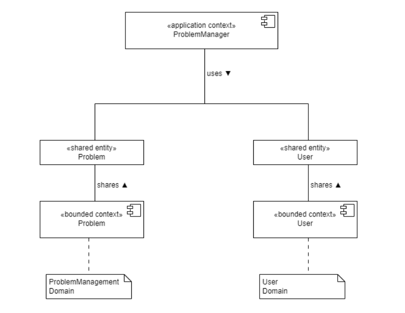

# ProblemManager Sharing View

Die Anwendung des ProblemManager kümmert sich um die Abwicklung der Problem Anfragen. Sie verwendet die Entitäten des Problem Context der von der ProblemManagement Domain bereitgestellt wird. Ähnlich zum GebäudeManager werden auch hier unter anderem personenbezogene Daten benötigt. Falls beispielsweise ein Benutzer ein eine Problemanfrage stellen möchte, muss erst überprüft werden, ob er dazu befugt ist. Diese Daten werden von der User Domain bereitgestellt und die daraus hervorgehende Entität wird mit dem ProblemManager geteilt.

