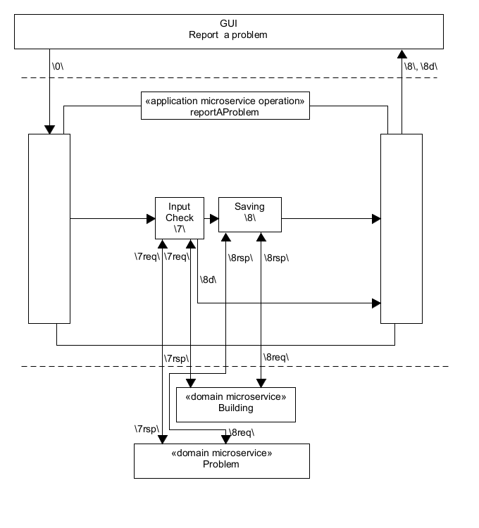
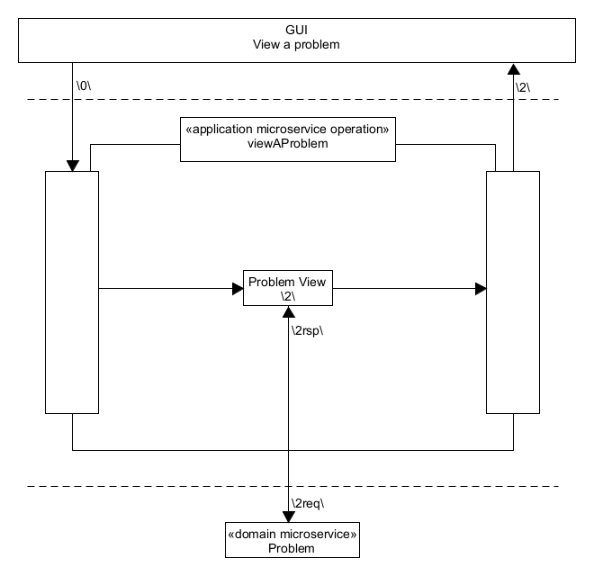
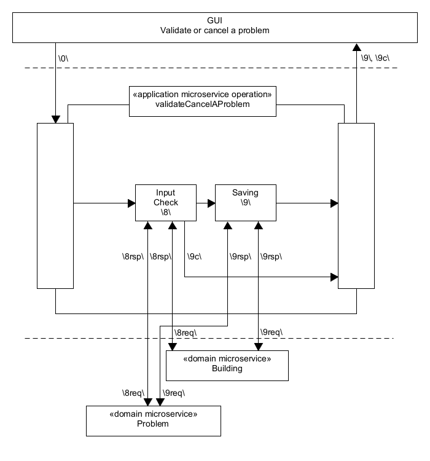
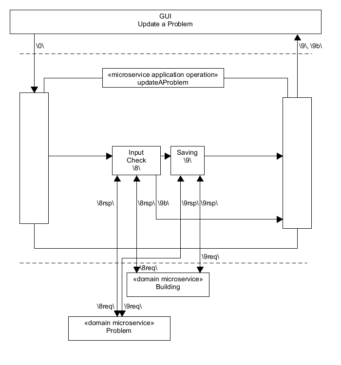
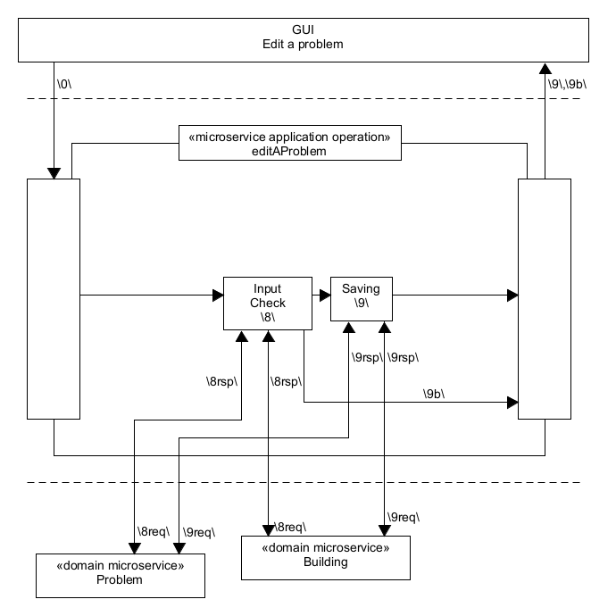

# Task Processes

## Application Microservice  **`Problem Management`**

- [Report a Problem](#report-a-problem)

- [View a Problem](#view-a-problem)

- [Validate/Decline a Problem](#validate/decline-a-problem)

- [Update a Problem](#update-a-problem)

- [Edit a Problem](#edit-a-problem)

### Report a Problem

### View a Problem

### Validate/Decline a Problem

### Update a Problem

### Edit a Problem

